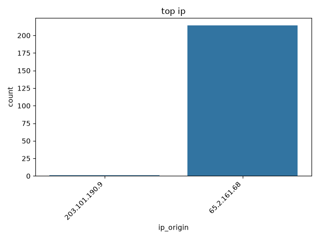
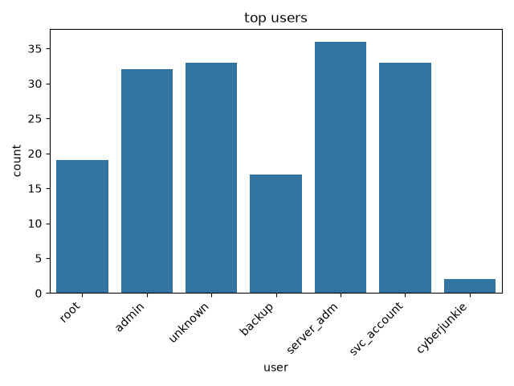
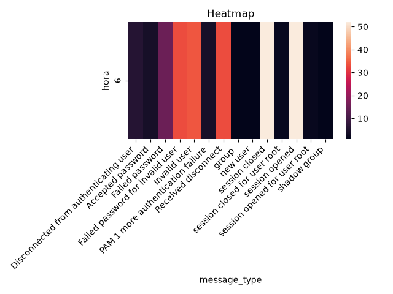

#  Security Log Analyzer

Un analizador de logs de autenticación de Linux (`auth.log`) construido en Python para detectar patrones de ataque — fuerza bruta, enumeración de usuarios, intrusiones exitosas y escalada de privilegios — y generar alertas legibles en consola junto con visualizaciones del incidente.

Este proyecto fue construido como caso de estudio práctico sobre el **Sherlock "Brutus"** de [HackTheBox](https://www.hackthebox.com/), un dataset real que documenta un ataque SSH completo: desde la fuerza bruta inicial hasta la creación de una cuenta backdoor y la exfiltración de credenciales.

---

##  Vista previa

| Timeline del ataque | Top IPs atacantes |
|---|---|
|  |  |

| Usuarios objetivo | Heatmap de actividad |
|---|---|
|  |  |

---

##  Características

El motor de detección identifica cuatro patrones de ataque sobre el log parseado:

- **Fuerza bruta SSH** — múltiples intentos fallidos de contraseña desde una misma IP en una ventana de tiempo corta
- **Enumeración de usuarios** — una IP probando múltiples nombres de usuario distintos (`admin`, `oracle`, `backup`, etc.)
- **Intrusión exitosa** — una IP que tuvo intentos fallidos seguidos de un login exitoso (`Accepted password`)
- **Escalada de privilegios** — creación de usuarios (`useradd`), modificación de grupos (`usermod`) y ejecución de comandos vía `sudo`

Cada detección genera:
- Una **alerta en consola** formateada con [`rich`](https://github.com/Textualize/rich), con severidad y contexto del evento
- **Gráficas exportadas** a `reports/figures/` (timeline, ranking de IPs, usuarios objetivo, mapa de calor de actividad)

---

##  Stack tecnológico

| Herramienta | Uso |
|---|---|
| **Python 3.14** | Lenguaje base |
| **pandas** | Parseo, transformación y análisis del log como DataFrame |
| **regex** | Extracción de campos estructurados desde líneas de log crudas |
| **matplotlib / seaborn** | Visualización de patrones de ataque |
| **rich** | Alertas formateadas y coloreadas en consola |
| **click** | Interfaz de línea de comandos (CLI) |
| **pytest** | Tests unitarios del parser y el motor de detección |
| **Jupyter** | Notebooks de exploración, detección y reporte forense |

---

##  Estructura del proyecto

```
security-log-analyzer/
│
├── data/
│   ├── raw/                    # Logs originales sin tocar (auth.log de Brutus)
│   ├── processed/              # DataFrames exportados
│   └── sample/                 # Logs sintéticos para tests
│
├── src/
│   ├── parser.py                # Parseo de líneas de log → DataFrame
│   ├── detector.py              # Motor de detección de patrones de ataque
│   ├── alert.py                 # Generación y formato de alertas en consola
│   └── visualizer.py            # Gráficas con matplotlib/seaborn
│
├── notebooks/
│   ├── 01_exploration.ipynb     # EDA inicial del dataset Brutus
│   ├── 02_detection.ipynb       # Demostración del motor de detección
│   ├── 03_visualization.ipynb   # Dashboard visual del análisis
│   └── 04_report.ipynb          # Informe forense final
│
├── tests/
│   ├── test_parser.py
│   ├── test_detector.py
│   └── fixtures/                # Líneas de log de muestra para tests
│
├── reports/
│   └── figures/                 # Gráficas exportadas como PNG
│
├── main.py                      # Entry point CLI
├── requirements.txt
├── requirements-dev.txt
└── README.md
```

---

##  Instalación

```bash
# Clonar el repositorio
git clone <url-del-repo>
cd security-log-analyzer

# Crear y activar entorno virtual
python -m venv .env
source .env/bin/activate        # Linux/Mac
.env\Scripts\activate           # Windows

# Instalar dependencias
pip install -r requirements-dev.txt
```

---

##  Uso

Corre el análisis completo sobre un archivo `auth.log`:

```bash
python main.py --log data/raw/auth.log
```

Esto ejecuta el pipeline completo:

```
parser → detector → alertas en consola → gráficas exportadas
```

**Salida esperada (resumida):**

```
ALERTA
Se ha detectado un posible ataque de fuerza bruta
La ip 65.2.161.68 ha realizado 48 intentos en el rango de 0 horas 0 minutos con 9 segundos

ALERTA
Se ha detectado un posible ataque de enumeracion de usuarios
La ip 65.2.161.68 ha intentado acceder con los siguientes usuarios: admin, backup, server_adm, ...

ALERTA
Se ha detectado un posible ataque de intrusion exitosa
La ip 65.2.161.68 ha tenido acceso exitoso
Con los siguientes intentos: 33 con usuario incorrecto, 15 con contraseña incorrecta, 3 exitosos

ALERTA
Se ha detectado un posible ataque de escala de privilegios
El usuario cyberjunkie ha escalado privilegios en el sistema
Ha ejecutado los siguientes comandos: cat /etc/shadow, curl https://raw.githubusercontent.com/...
```

Las gráficas generadas quedan guardadas en `reports/figures/`.

---

##  Caso de estudio: Sherlock Brutus (HTB)

El dataset usado para validar este proyecto es real y documenta un ataque completo:

1. **06:31:31** — Inicio de enumeración de usuarios desde `65.2.161.68`
2. **06:31:40** — Acceso exitoso como `root` tras 48 intentos fallidos en 9 segundos
3. **06:34:18** — Creación de la cuenta backdoor `cyberjunkie`
4. **06:35:15** — `cyberjunkie` añadido al grupo `sudo`
5. **06:37:57** — Lectura de `/etc/shadow` vía `sudo`
6. **06:39:38** — Descarga de un script de persistencia externo (`linper.sh`)

El análisis forense completo, con línea de tiempo, evidencia visual y recomendaciones de mitigación, está documentado en [`notebooks/04_report.ipynb`](notebooks/04_report.ipynb).

---

##  Tests

El proyecto cuenta con tests unitarios para el parser y el motor de detección:

```bash
pytest tests/
```

Los tests usan fixtures con líneas de log controladas (`tests/fixtures/`) en lugar del dataset completo, para validar cada campo extraído y cada función de detección de forma aislada.

---

## 📚Lo aprendido

Este proyecto fue una forma práctica de combinar dos áreas de interés — ciberseguridad y data science — y de aplicar:

- Diseño de expresiones regulares para parsear texto no estructurado del mundo real
- Análisis de series temporales con pandas (`groupby`, `pivot_table`, ventanas de tiempo)
- Diseño de un motor de reglas para detección de amenazas
- Buenas prácticas de arquitectura de software: separación en capas (parser → detector → alerter → visualizer), tests unitarios y CLI

### Próximos pasos

- Soporte para más formatos de log (`nginx`, `journald`)
- Integración con feeds de IPs maliciosas (AbuseIPDB)
- Detección de anomalías con `scikit-learn` (Isolation Forest)
- Dashboard interactivo con Streamlit

---

##  Licencia

Proyecto personal con fines educativos y de portafolio.
